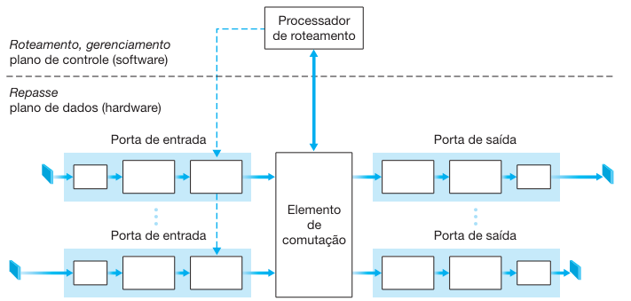
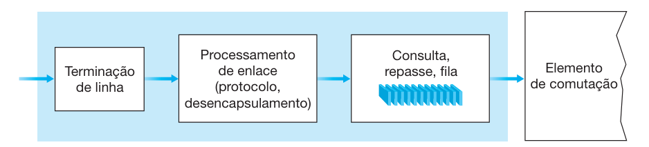
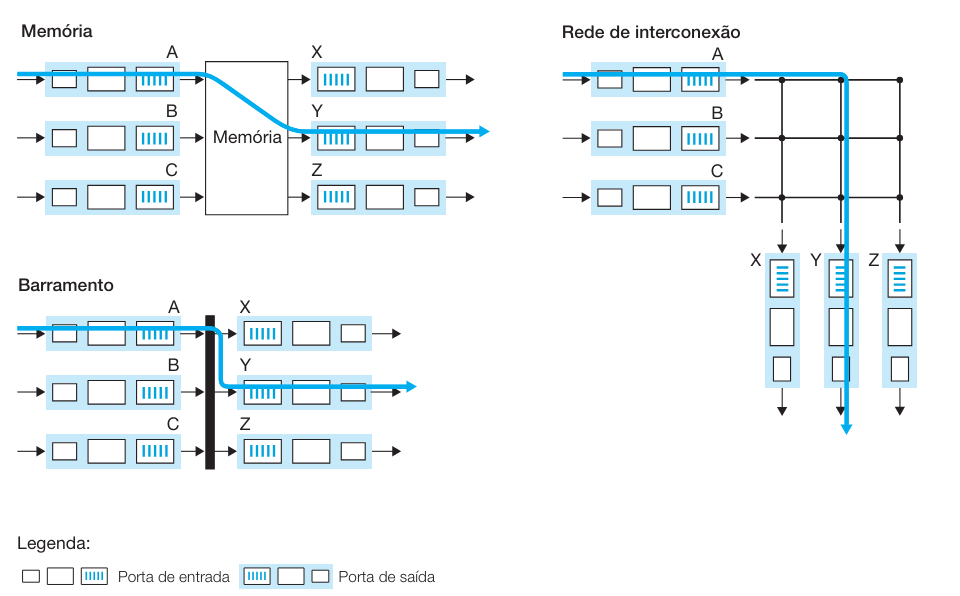
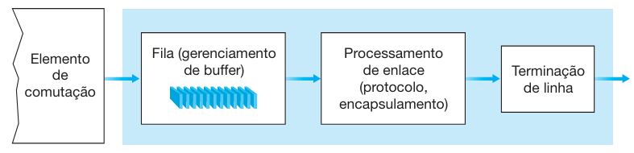
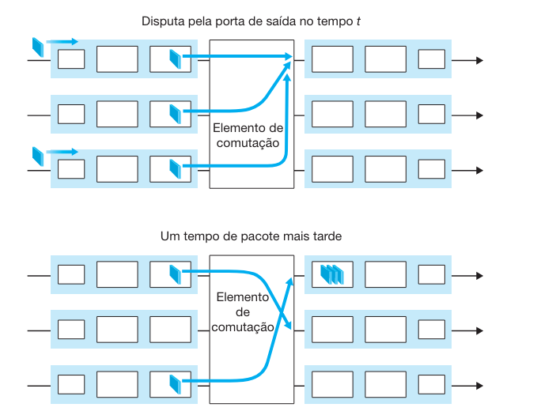

# O Que Há Dentro de um Roteador?

Uma visão de alto nível da arquitetura de um roteador genérico é mostrada na Figura 4.6. Quatro componentes de um roteador podem ser identificados:

## Portas de Entrada
A porta de entrada tem diversas funções:
- **Camada Física**: Termina um enlace físico de entrada em um roteador.
- **Camada de Enlace**: Necessária para interoperar com as funções da camada de enlace do outro lado do enlace de entrada.
- **Função de Exame**: Consulta a tabela de repasse para determinar a porta de saída do roteador à qual um pacote que chega será repassado pelo elemento de comutação. Pacotes de controle são repassados para o processador de roteamento.

## Elemento de Comutação
O elemento de comutação conecta as portas de entrada do roteador às suas portas de saída, funcionando como uma rede interna dentro do roteador.

## Portas de Saída
A porta de saída armazena os pacotes que foram repassados a ela através do elemento de comutação e os transmite até o enlace de saída, realizando as funções necessárias das camadas de enlace e física.

## Processador de Roteamento
O processador de roteamento executa os protocolos de roteamento, mantém as tabelas de roteamento e as informações de estado do enlace, e calcula a tabela de repasse para o roteador.

As portas de entrada, portas de saída e elemento de comutação de um roteador executam a função de repasse e quase sempre são implementadas no hardware. Essas funções são chamadas coletivamente de plano de repasse do roteador. O plano de controle do roteador, que executa os protocolos de roteamento e realiza funções de gerenciamento, geralmente opera no processador de roteamento.

## Processamento de Entrada

As funções de terminação de linha e de processamento de enlace realizadas pela porta de entrada implementam as funções das camadas física e de enlace associadas a um enlace de entrada individual do roteador. A pesquisa realizada na porta de entrada é fundamental para a operação do roteador, determinando a porta de saída para a qual o pacote será repassado pelo elemento de comutação.

Quando a porta de saída de um pacote é determinada, ele pode ser enviado para o elemento de comutação. Se os pacotes de outras portas de entrada estiverem usando o elemento nesse instante, o pacote ficará enfileirado na porta de entrada.

Outras ações no processamento da porta de entrada incluem:
1. Processamento da camada física e de enlace.
2. Verificação e reescrita dos campos de número de versão, soma de verificação e tempo de vida do pacote.
3. Atualização de contadores de gerenciamento de rede.

## Elemento de Comutação

O elemento de comutação é responsável por transferir pacotes de uma porta de entrada para uma porta de saída. As técnicas de comutação incluem:

### Comutação por Memória
Os primeiros roteadores usavam computadores tradicionais onde a comutação era controlada diretamente pela CPU, copiando pacotes da porta de entrada para a memória do processador e depois para os buffers da porta de saída.

### Comutação por Barramento
As portas de entrada transferem pacotes diretamente para a porta de saída por um barramento compartilhado, sem intervenção do processador de roteamento. A porta de entrada insere um rótulo interno ao comutador indicando a porta de saída local.

### Comutação por Rede de Interconexão
Utiliza uma rede de interconexão sofisticada, como um comutador do tipo crossbar, que conecta portas de entrada e saída através de múltiplos barramentos.

## Processamento de Saída

O processamento de portas de saída toma os pacotes armazenados e os transmite pelo enlace de saída, realizando funções necessárias nas camadas de enlace e física.

## Onde Ocorre a Formação de Fila?

Filas de pacotes podem se formar nas portas de entrada e saída, dependendo da carga de tráfego, da velocidade do elemento de comutação e da taxa da linha. A memória do roteador pode se esgotar, resultando em perda de pacotes.

## O Plano de Controle de Roteamento

O plano de controle de roteamento é descentralizado, com diferentes partes do algoritmo de roteamento executando em diferentes roteadores e interagindo por meio de mensagens de controle entre si.
