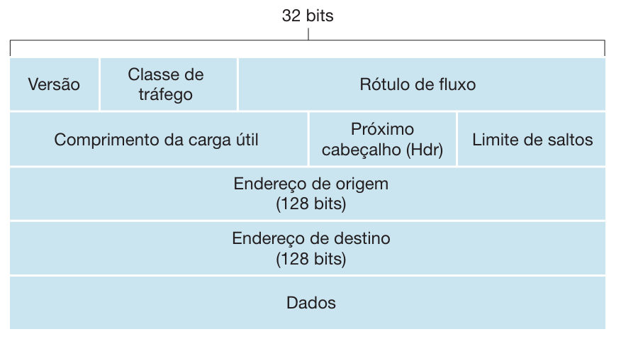

___

# Protocolo IPv6

## Visão Geral do IPv6

Para atender à necessidade de um maior espaço para endereços IP, foi desenvolvido um novo protocolo IP, o IPv6. Os projetistas do IPv6 também aproveitaram essa oportunidade para ajustar e ampliar outros aspectos do IPv4, com base na experiência operacional acumulada sobre esse protocolo.

## Formato do Datagrama IPv6

O formato do datagrama IPv6 é mostrado na figura acima. As mudanças mais importantes introduzidas no IPv6 ficam evidentes no formato do datagrama:

- **Capacidade de Endereçamento Expandida**: O IPv6 aumenta o tamanho do endereço IP de 32 bits para 128 bits. Isso garante que o mundo não ficará sem endereços IP.
- **Cabeçalho Aprimorado de 40 Bytes**: O cabeçalho de comprimento fixo de 40 bytes permite um processamento mais veloz do datagrama IP.
- **Rotulação de Fluxo e Prioridade**: Introduz novos campos no cabeçalho para rotulação de fluxo e prioridade de pacotes, permitindo melhor gerenciamento de tráfego e qualidade de serviço (QoS).

## Campos do Cabeçalho IPv6

Os principais campos do cabeçalho IPv6 incluem:

- **Versão**: Especifica a versão do protocolo IP (IPv6).
- **Classe de Tráfego**: Indica a prioridade do pacote.
- **Rótulo de Fluxo**: Usado para identificar fluxos de pacotes que requerem tratamento especial.
- **Comprimento do Payload**: Indica o tamanho dos dados transportados pelo datagrama.
- **Próximo Cabeçalho**: Indica o tipo do cabeçalho seguinte (equivalente ao campo Protocolo do IPv4).
- **Limite de Saltos (Hop Limit)**: Similar ao campo TTL no IPv4, previne que pacotes circulem indefinidamente.
- **Endereço de Origem**: Endereço IP do remetente.
- **Endereço de Destino**: Endereço IP do destinatário.

## Transição do IPv4 para o IPv6

A transição do IPv4 para o IPv6 é um processo complexo devido à incompatibilidade direta entre os dois protocolos. Enquanto os novos sistemas habilitados para IPv6 podem ser compatíveis, ou seja, podem enviar, rotear e receber datagramas IPv4, os sistemas habilitados para IPv4 não podem manusear datagramas IPv6.

### Estratégias de Transição

- **Pilhas Duplas (Dual Stack)**: Implementação simultânea do IPv4 e IPv6 nos dispositivos de rede, permitindo a comunicação através de ambos os protocolos.
- **Túnel (Tunneling)**: Encapsulamento de pacotes IPv6 dentro de pacotes IPv4 para transporte através de redes IPv4.
- **Tradução de Endereços (NAT64)**: Tradução de endereços entre IPv6 e IPv4 para permitir a comunicação entre dispositivos usando diferentes versões do protocolo.

### Desafios da Transição

- **Compatibilidade**: Garantir que dispositivos e aplicações suportem IPv6 sem problemas de interoperabilidade.
- **Infraestrutura**: Atualização de roteadores, switches e outros equipamentos de rede para suportar IPv6.
- **Segurança**: Ajustar políticas de segurança e firewalls para lidar com o novo espaço de endereçamento e características do IPv6.

A transição para o IPv6 é essencial para suportar o crescimento contínuo da Internet e a expansão dos dispositivos conectados. No entanto, devido à complexidade e ao custo, a transição completa ainda está em andamento globalmente.
