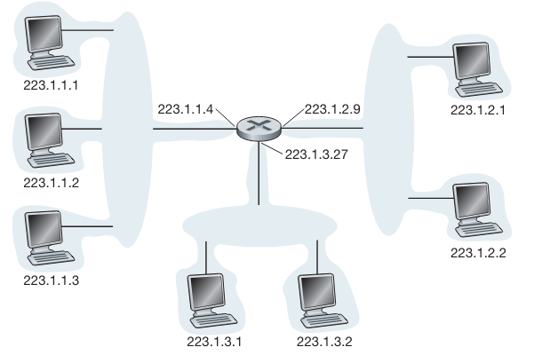
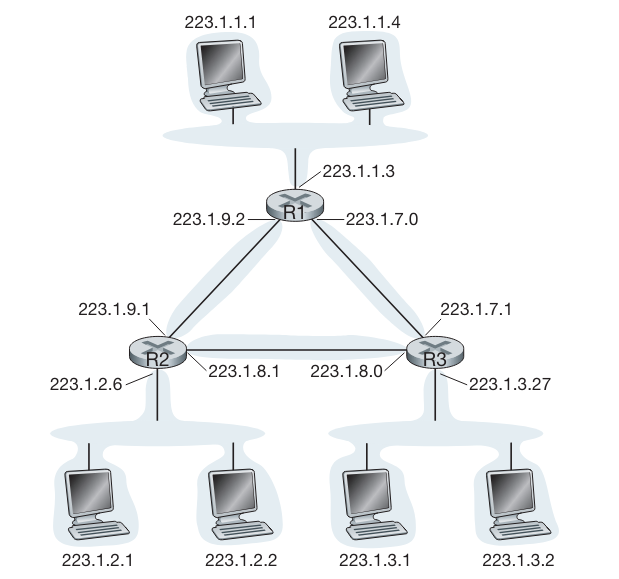

# Protocolo IP

## Componentes da Camada de Rede da Internet

A camada de rede da Internet é composta por três componentes principais:

1. **Protocolo IP**
2. **Componente de roteamento**: Determina o caminho que um datagrama segue desde a origem até o destino.
3. **Dispositivo para comunicação de erros e requisições**: Gerencia erros em datagramas e atende a requisições de informações da camada de rede.

## Formato de Datagrama

Um pacote de camada de rede é denominado **datagrama**. O formato do datagrama IPv4 é mostrado na figura abaixo. Seus principais campos são:

- **Número da versão**: Especifica a versão do protocolo IP do datagrama (4 bits).
- **Comprimento do cabeçalho**: Determina onde os dados começam no datagrama IP (4 bits).
- **Tipo de serviço (TOS)**: Diferencia os diferentes tipos de datagramas IP.
- **Comprimento do datagrama**: Comprimento total do datagrama IP (16 bits).
- **Identificador, flags, deslocamento de fragmentação**: Relacionados à fragmentação do IP.
- **Tempo de vida (TTL)**: Garante que datagramas não circulem indefinidamente na rede.
- **Protocolo**: Indica o protocolo de camada de transporte ao qual os dados serão passados.
- **Soma de verificação do cabeçalho**: Auxilia na detecção de erros de bits.
- **Endereços IP de origem e de destino**: Contêm os endereços IP da origem e do destino final.
- **Opções**: Permite a extensão do cabeçalho IP.
- **Dados (carga útil)**: Contém o segmento da camada de transporte ou outros tipos de dados.

## Endereçamento IPv4

Um hospedeiro geralmente possui um único enlace com a rede, e o IP envia datagramas por meio desse enlace. A fronteira entre o hospedeiro e o enlace físico é chamada de interface.

Um roteador, por outro lado, conecta-se a dois ou mais enlaces, recebendo datagramas de um enlace e repassando-os a outro. Cada conexão de um roteador é uma interface. 

Cada interface, tanto em hospedeiros quanto em roteadores, deve ter seu próprio endereço IP. Portanto, um endereço IP é associado a uma interface específica, não ao hospedeiro ou roteador em si.

Cada endereço IP tem comprimento de 32 bits (4 bytes), resultando em um total de 2³² endereços possíveis, cerca de 4 bilhões. Esses endereços são escritos em notação decimal separada por pontos. Por exemplo, o endereço IP 193.32.216.9 em notação binária é: `11000001 00100000 11011000 00001001`.

Cada interface em cada hospedeiro e roteador da Internet global tem de ter um endereço IP globalmente exclusivo (exceto as interfaces por trás de NATs). Contudo, os endereços não podem ser escolhidos de qualquer maneira. Uma parte do endereço IP de uma interface será determinada pela sub-rede à qual ela está conectada.

### Interfaces e Sub-redes

- **Interface**: Fronteira entre o hospedeiro e o enlace físico.
- **Sub-rede**: Conjunto de interfaces interconectadas sem roteador intermediário. 

### Exemplo de Endereçamento IP e Interfaces

A figura abaixo mostra um roteador interconectando sete hospedeiros. Os endereços IP atribuídos às interfaces de hospedeiros e roteadores têm os mesmos 24 bits mais à esquerda e formam uma sub-rede.

- **Sub-rede 223.1.1.0/24**: Consiste em três interfaces de hospedeiros (223.1.1.1, 223.1.1.2, 223.1.1.3) e uma interface de roteador (223.1.1.4).
- **Outras sub-redes**: 223.1.2.0/24 e 223.1.3.0/24.

Agora considere a figura abaixo, que mostra três roteadores interconectados por enlaces ponto a ponto. Cada roteador tem três interfaces, uma para cada enlace ponto a ponto e uma para o enlace para um grupo, que conecta diretamente o roteador a um par de hospedeiros. Que sub-redes IP estão presentes aqui? Três sub-redes, 223.1.1.0/24, 223.1.2.0/24 e 223.1.3.0/24, semelhantes às que encontramos na Figura anterior. Mas note que também há três sub-redes adicionais nesse exemplo: uma sub-rede, 223.1.9.0/24, para as interfaces que conectam os roteadores R1 e R2; outra, 223.1.8.0/24, para as interfaces que conectam os roteadores R2 e R3, e uma terceira, 223.1.7.0/24, para as interfaces que conectam os roteadores R3 e R1. Para um sistema geral interconectado de roteadores e hospedeiros, podemos usar a seguinte receita para definir as sub-redes no sistema: Para determinar as sub-redes, destaque cada interface de seu hospedeiro ou roteador, criando ilhas de redes isoladas com interfaces fechando as terminações das redes isoladas. Cada uma dessas redes isoladas é denominada sub-rede.

(assim, a figura possui seis ilhas ou sub-redes)

A estratégia de atribuição de endereços da Internet é conhecida como roteamento interdomínio sem classes (Classless Interdomain Routing — CIDR), que se pronuncia “sáider”, como a palavra cider (cidra) em inglês [RFC 4632]. O CIDR generaliza a noção de endereçamento de sub-rede. Como acontece com o endereçamento de sub-redes, o endereço IP de 32 bits é dividido em duas partes e, mais uma vez, tem a forma decimal com pontos de separação a.b.c.d/x, em que x indica o número de bits da primeira parte do endereço.

Os x bits mais significativos de um endereço na forma a.b.c.d/x constituem a parcela da rede do endereço IP e costumam ser denominados prefixo (ou prefixo de rede). Uma organização em geral recebe um bloco de endereços contíguos, isto é, uma faixa de endereços com um prefixo comum. Nesse caso, os endereços IP de equipamentos e dispositivos dentro da organização compartilharão o prefixo comum.

O protocolo de roteamento BGP da Internet considera somente esses x bits indicativos do prefixo. Isto é, quando um roteador de fora repassar um datagrama cujo endereço de destino esteja dentro da organização, terá de considerar apenas os x bits indicativos do endereço. Isso reduz de modo considerável o tamanho da tabela de repasse nesses roteadores, visto que um único registro da forma a.b.c.d/x será suficiente para transmitir pacotes para qualquer destino dentro da organização.

Os restantes (32 – x) bits de um endereço podem ser considerados os bits que distinguem os equipamentos e dispositivos dentro da organização e todos eles têm o mesmo prefixo de rede. Eles serão os bits considerados no repasse de pacotes em roteadores dentro da organização. Esses bits de ordem mais baixa podem (ou não) ter uma estrutura adicional de sub-rede tal como a discutida anteriormente. Por exemplo, suponha que os primeiros 21 bits do endereço a.b.c.d/21, por assim dizer, “ciderizado”, especificam o prefixo da rede da organização e são comuns aos endereços IP de todos os hospedeiros da organização. Os 11 bits restantes então identificam os hospedeiros específicos da organização. A estrutura interna da organização poderia ser tal que esses 11 bits mais à direita seriam usados para criar uma sub-rede dentro da organização, como discutido antes. Por exemplo, a.b.c.d/24 poderia se referir a uma sub-rede específica dentro da organização.

Antes da adoção do CIDR, os tamanhos das parcelas de um endereço IP estavam limitados a 8, 16 ou 24 bits, um esquema de endereçamento conhecido como endereçamento com classes, já que sub-redes com endereços de sub-rede de 8, 16 e 24 eram conhecidas como redes de classe A, B e C, respectivamente. A exigência de que a parcela da sub-rede de um endereço IP tenha exatos 1, 2 ou 3 bytes há muito tempo se mostrou problemática para suportar o rápido crescimento do número de organizações com sub-redes de pequeno e médio portes. Uma sub-rede de classe C (/24) poderia acomodar apenas 28 – 2 = 254 hospedeiros (dois dos 28 = 256 endereços são reservados para uso especial) — muito pequena para inúmeras organizações. Contudo, uma sub-rede de classe B (/16), que suporta até 65.634 hospedeiros, seria grande demais. Com o endereçamento com classes, uma organização com, digamos, dois mil hospedeiros, recebia um endereço de sub-rede de classe B (/16), o que resultava no rápido esgotamento do espaço de endereços de classe B e na má utilização do espaço de endereço alocado. Por exemplo, uma organização que usasse um endereço de classe B para seus dois mil hospedeiros, recebia espaço de endereços suficiente para até 65.534 interfaces — deixando mais de 63 mil endereços sem uso e que não poderiam ser utilizados por outras organizações.

Quando um hospedeiro emite um datagrama com endereço de destino 255.255.255.255, a mensagem é entregue a todos os hospedeiros na mesma sub-rede. Os roteadores também têm a opção de repassar a mensagem para suas sub-redes vizinhas (embora em geral não o façam).
