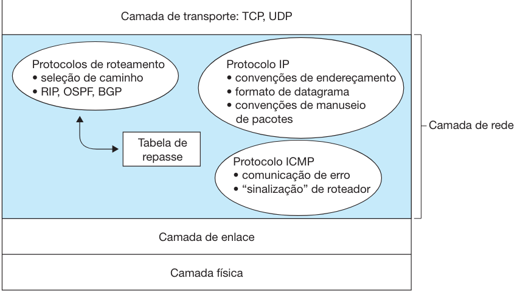
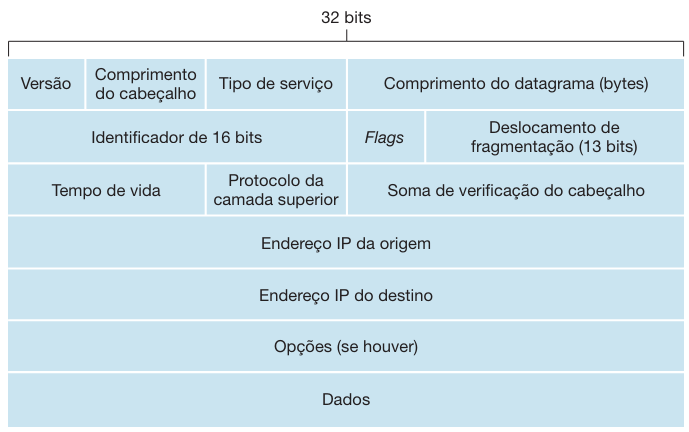

# Protocolo IP

## Componentes da Camada de Rede da Internet

A camada de rede da Internet é composta por três componentes principais:

1. **Protocolo IP**
2. **Componente de roteamento**: Determina o caminho que um datagrama segue desde a origem até o destino.
3. **Dispositivo para comunicação de erros e requisições**: Gerencia erros em datagramas e atende a requisições de informações da camada de rede.

## Formato de Datagrama

Um pacote de camada de rede é denominado **datagrama**. O formato do datagrama IPv4 é mostrado na figura abaixo. Seus principais campos são:

- **Número da versão**: Especifica a versão do protocolo IP do datagrama (4 bits).
- **Comprimento do cabeçalho**: Determina onde os dados começam no datagrama IP (4 bits).
- **Tipo de serviço (TOS)**: Diferencia os diferentes tipos de datagramas IP.
- **Comprimento do datagrama**: Comprimento total do datagrama IP (16 bits).
- **Identificador, flags, deslocamento de fragmentação**: Relacionados à fragmentação do IP.
- **Tempo de vida (TTL)**: Garante que datagramas não circulem indefinidamente na rede.
- **Protocolo**: Indica o protocolo de camada de transporte ao qual os dados serão passados.
- **Soma de verificação do cabeçalho**: Auxilia na detecção de erros de bits.
- **Endereços IP de origem e de destino**: Contêm os endereços IP da origem e do destino final.
- **Opções**: Permite a extensão do cabeçalho IP.
- **Dados (carga útil)**: Contém o segmento da camada de transporte ou outros tipos de dados.

## Endereçamento IPv4

Cada endereço IP tem comprimento de 32 bits (4 bytes), resultando em um total de 2³² endereços possíveis, cerca de 4 bilhões. Esses endereços são escritos em notação decimal separada por pontos. Por exemplo, o endereço IP 193.32.216.9 em notação binária é: `11000001 00100000 11011000 00001001`.

### Interfaces e Sub-redes

- **Interface**: Fronteira entre o hospedeiro e o enlace físico.
- **Sub-rede**: Conjunto de interfaces interconectadas sem roteador intermediário. 

### Exemplo de Endereçamento IP e Interfaces

A figura abaixo mostra um roteador interconectando sete hospedeiros. Os endereços IP atribuídos às interfaces de hospedeiros e roteadores têm os mesmos 24 bits mais à esquerda e formam uma sub-rede.

- **Sub-rede 223.1.1.0/24**: Consiste em três interfaces de hospedeiros (223.1.1.1, 223.1.1.2, 223.1.1.3) e uma interface de roteador (223.1.1.4).
- **Outras sub-redes**: 223.1.2.0/24 e 223.1.3.0/24.

