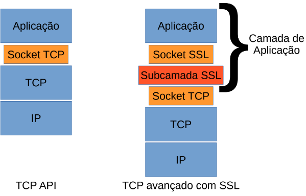
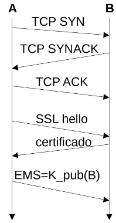
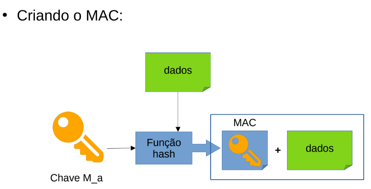

# Protegendo Conexões TCP – SSL

A criptografia pode aprimorar o TCP com os serviços de segurança, incluindo:
- **Sigilo**
- **Integridade**
- **Autenticação**

Esta versão aprimorada do TCP é denominada Camada Segura de Sockets (Secure Sockets Layer – SSL).

- O SSL foi originalmente projetado pela Netscape.
- Atualmente é suportado por todos os navegadores Web e servidores.
- Muitas vezes o SSL é usado para oferecer segurança em transações que ocorrem pelo HTTP, resultando no HTTPS.
- Entretanto, como o SSL protege o TCP, ele pode ser empregado por qualquer aplicação que execute o TCP.

Começaremos com uma versão simplificada do SSL, para depois analisarmos o SSL completo. Esta versão será composta por três fases:
1. **Apresentação (handshake)**
2. **Derivação de chave**
3. **Transferência de dados**

## Apresentação (Handshake)

Durante esta fase, um host A precisa estabelecer uma conexão TCP com um host B, verificar a autenticidade de sua identificação e enviar-lhe uma chave secreta mestre.

1. Estabelecer uma conexão TCP (host A → B).
2. Verificar a autenticidade de sua identificação.
3. Enviar-lhe uma chave secreta mestre.
    - **MS:** segredo mestre.
    - **EMS:** segredo mestre cifrado.
    - **K_pub(B):** chave pública de B.

## Derivação de Chave

Com o MS (segredo mestre) compartilhado entre os hosts A e B, este segredo poderia ser usado como chave de sessão simétrica por ambos. Contudo, em geral, considera-se mais seguro para ambos usarem chaves criptográficas diferentes. Com base na MS, 4 chaves são criadas (derivadas a partir dela):

- **E_a:** chave de criptografia de sessão para dados enviados de A para B.
- **M_a:** chave MAC de sessão para dados enviados de A para B.
- **E_b:** chave de criptografia de sessão para dados enviados de B para A.
- **M_b:** chave MAC de sessão para dados enviados de B para A.

**MAC** - Message Authentication Code

- As chaves de criptografia (E_a e E_b) são usadas para cifrar os dados.
- As chaves MAC (M_a e M_b) são usadas para verificar a autenticidade, ou seja, garantir que os dados de fato vieram da origem esperada.

## Transferência de Dados

Na transferência, o SSL divide o fluxo de dados em unidades chamadas de registros. Cada registro terá ainda o MAC anexado, de modo a ser possível verificar a autenticidade dos dados. Para criar o MAC:
- Dados do registro + chave M_a → função hash

## Uma Visão Mais Completa

1. Cliente envia uma lista de algoritmos criptográficos que ele suporta, junto com um nonce.
2. Servidor retorna escolhendo um algoritmo simétrico, um algoritmo de chave pública e um algoritmo MAC. É retornado ainda um certificado e um nonce do servidor.
3. O cliente extrai a chave pública do certificado, gera um segredo Pré-Mestre (PMS), cifra o PMS usando a chave pública do servidor, e envia o PMS cifrado ao servidor.

**Nonce:** (number once) é um número arbitrário que somente pode ser usado uma vez em uma comunicação criptografada.

4. Utilizando a mesma função de derivação de chave, cliente e servidor calculam de maneira independente o Segredo Mestre (MS) do PMS e dos nonces. O MS dará origem a: duas chaves de criptografia; duas chaves MAC. A partir deste ponto, todas as mensagens serão encriptadas e autenticadas (com o MAC).
5. O cliente envia um MAC de todas as mensagens de apresentação.
6. O servidor envia um MAC de todas as mensagens de apresentação.

Repare que as mensagens 1 e 2, por não serem encriptadas, estão sujeitas ao ataque de man in the middle. Por este motivo, há o envio do MAC nos passos 5 e 6 para as mensagens de apresentação.

## Encerramento da Conexão

Em algum momento haverá o encerramento da conexão...
- Uma possível maneira seria encerrar a conexão TCP (TCP FIN), fazendo com que a conexão SSL fosse também encerrada.

Problema: Esta ação permitiria o ataque por truncamento.
- Lembre-se que o cabeçalho TCP não é criptografado.
- Qualquer usuário mal-intencionado no meio está apto a realizar este tipo de ação.
- O encerramento da conexão TCP (antes de receber um registro SSL de encerramento) é um sinal para o servidor que algo estranho aconteceu.
