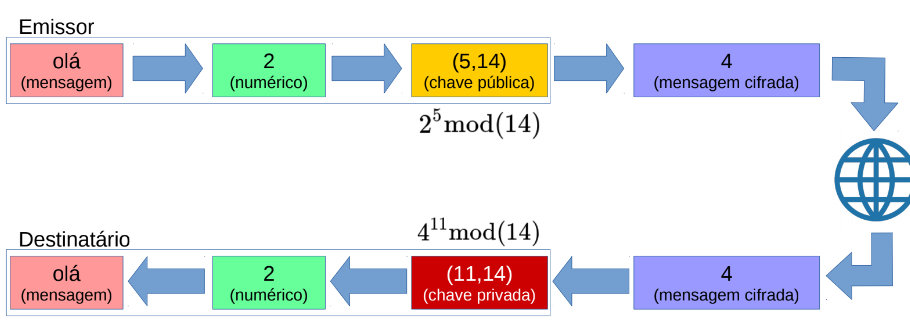
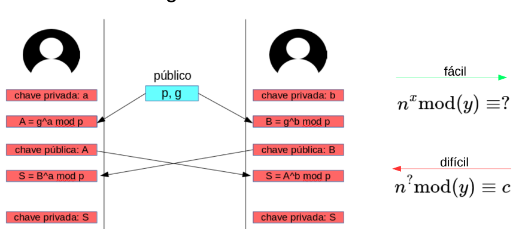

# Introdução à Criptografia

Criptologia é a disciplina que reúne os conhecimentos e as técnicas necessárias à:

- **Criptografia:** Modificação codificada;
  - Elabora códigos.

- **Criptoanálise:** Solução de criptogramas;
  - Quebra códigos.

## Tipos de Algoritmos Criptográficos

- **Encriptação:** Codifica a informação de modo a torná-la confidencial.
- **Desencriptação:** Realiza o processo inverso.
- **Funções Hash:** Função em um único sentido usada para assegurar a integridade dos dados.

## Termos Comuns

Todos os algoritmos criptográficos possuem alguns termos em comum:

- **Texto Simples (plaintext):** A mensagem a ser encriptada.
- **Texto Cifrado (ciphertext):** Versão encriptada da mensagem.
- **Chave Secreta (secret key):** Um valor secreto usado como parte do processo de encriptação/desencriptação.
- **Algoritmo:** Processo matemático que faz uso da chave secreta para transformar o texto simples no texto cifrado ou vice-versa.

## Classificação dos Algoritmos

Algoritmos simétricos e assimétricos:

- **Classificação dos algoritmos do ponto de vista de como utilizam as chaves secretas:**
  - **Encriptação Simétrica:** Usam a mesma chave para encriptar e desencriptar.
  - **Encriptação Assimétrica:** Usam chaves diferentes para encriptar e desencriptar, também chamados de criptografia de chave pública.

- **Algoritmos Simétricos podem ser classificados como cifras de bloco ou de fluxo:**
  - **Cifras de Bloco (block cipher):** Encripta e desencripta os dados em blocos de tamanhos fixos.
  - **Cifras de Fluxo (stream cipher):** Encripta e desencripta os dados um bit por vez.

## Conceitos da Segurança da Informação

### Tríade CIA:

- **Confidencialidade:** Manter os dados protegidos de usuários não autorizados.
- **Integridade:** Garantir que os dados não tenham sido modificados.
- **Disponibilidade:** Garantir que os meios necessários para o acesso aos dados estejam sempre operacionais.

### Outro Objetivo Comum:

- Garantir que o autor de uma mensagem não possa negar sua autoria.

### Princípio de Kerckhoffs:

"Um sistema criptográfico deve ser seguro mesmo que tudo sobre o sistema, exceto a chave, seja de conhecimento público."

### Princípio de Confusão e Difusão:

- **Difusão:** Tornar a relação estatística entre o texto simples e o texto cifrado o mais complexa possível, a fim de evitar a descoberta da chave. Mudar um único bit do texto simples deve resultar na mudança de metade dos bits no texto cifrado (em média).
  
  Texto Simples <-> Texto Cifrado

- **Confusão:** Evitar a descoberta da chave de codificação, tornando o mais complexo possível a relação estatística entre o texto cifrado e a chave de codificação.

  Texto Cifrado <-> Chave

- **Entropia:** Mede o grau de aleatoriedade presente em um dado.
  - Texto simples possui um grau de entropia muito baixo.
  - Texto cifrado deve possuir um elevado grau de entropia.

## Algoritmo de Chave Simétrica

- **Algoritmos de chave simétrica usam a mesma chave para a encriptação e desencriptação.**
  - A chave deve ser compartilhada através de um canal seguro entre os pares.

- **Vantagens:**
  - Mais eficientes na transmissão de dados em grande volume (bulk).
  - Algoritmos de cifra de bloco podem ter seus blocos processados paralelamente.

## Algoritmo AES

- Algoritmo mais usado no mundo.
- Algoritmo de chave simétrica do tipo cifra de bloco:
  - Blocos de dados possuem 128 bits.
  - Chaves podem ter 128, 192 ou 256 bits.

- **Combinação de chave entre pares:**
  - Utiliza-se previamente um algoritmo de chaves assimétricas para a obtenção de uma chave comum entre os pares para o algoritmo simétrico (por exemplo, o AES).

## Algoritmos de Chaves Assimétricas

- Utilizam chaves diferentes para encriptar e desencriptar:
  - A segurança da chave pública se baseia no fato de que a mesma funciona como uma função de um único sentido.
  - Do contrário, a chave privada poderia ser derivada a partir da chave pública.

### Algoritmo RSA

- O algoritmo RSA (Rivest – Shamir – Adleman) é um algoritmo de chaves assimétricas usado para a transmissão de dados.

Um usuário mal-intencionado, que obtenha a chave pública (5,14) e a mensagem encriptada (4), ainda não será capaz de descobrir o conteúdo da mensagem original (2).

### Algoritmo Diffie-Hellman

- O algoritmo Diffie-Hellman é um algoritmo de chaves assimétricas usado para se obter uma chave privada em comum.

## Conclusões

- **Algoritmos de chave simétrica** são mais adequados na transmissão de grande quantidade de dados, mas precisam da existência prévia de uma mesma chave privada compartilhada entre os pares.
- **Algoritmos de chaves assimétricas (chaves pública/privada)** podem ser utilizados no estabelecimento prévio do canal seguro, para que então as chaves privadas do algoritmo simétrico sejam estabelecidas.
- Algoritmos encriptados mais populares hoje fazem uso do TLS (Transport Layer Security).
- As operações no estabelecimento da conexão encriptada funcionam de maneira simplificada assim:
  1. Estabelece-se o par de chaves privadas através do algoritmo Diffie-Hellman (assimétrico).
  2. Utiliza-se as chaves para realizar a encriptação dos dados através do algoritmo AES (simétrico).

Agora você tem uma visão geral de como o processo funciona, por exemplo, na transmissão encriptada do HTTPS, ou de qualquer outro protocolo.
