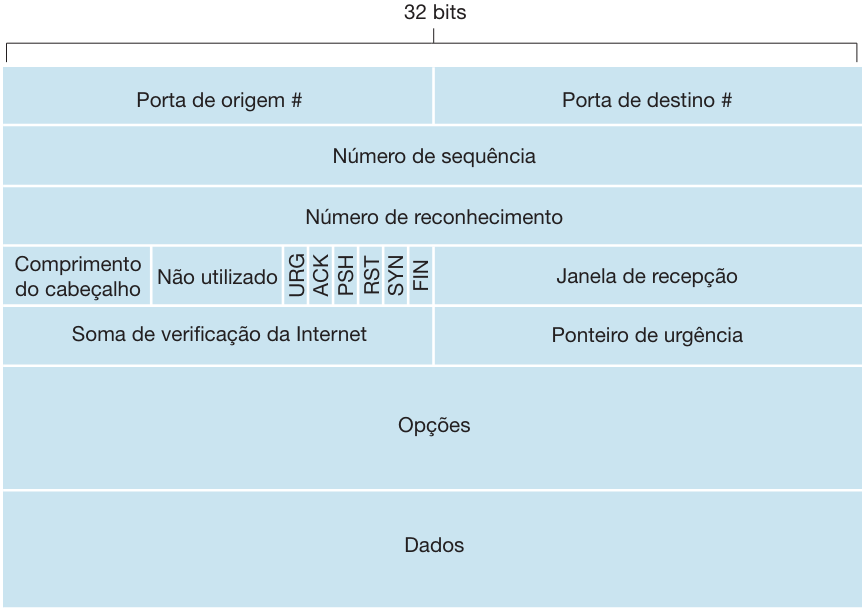

# TRANSPORTE ORIENTADO PARA CONEXÃO: TCP

Para poder fornecer transferência confiável de dados, o TCP conta com muitos dos princípios subjacentes, incluindo detecção de erro, retransmissões, reconhecimentos cumulativos, temporizadores e campos de cabeçalho para números de sequência e de reconhecimento.

## A Conexão TCP

Dizemos que o TCP é orientado para conexão porque, antes que um processo de aplicação possa começar a enviar dados a outro, os dois processos precisam primeiro se “apresentar” — isto é, devem enviar alguns segmentos preliminares um ao outro para estabelecer os parâmetros da transferência de dados.

Uma conexão TCP provê um serviço full-duplex: se houver uma conexão TCP entre o processo A em um hospedeiro e o processo B em outro hospedeiro, os dados da camada de aplicação poderão fluir de A para B ao mesmo tempo em que os dados da camada de aplicação fluem de B para A. A conexão TCP é sempre ponto a ponto, isto é, entre um único remetente e um único destinatário.

O chamado “multicast” — a transferência de dados de um remetente para vários destinatários em uma única operação de envio — não é possível com o TCP. Com o TCP, dois hospedeiros é bom; três é demais!

Para estabelecer uma conexão, o cliente primeiro envia um segmento TCP especial; o servidor responde com um segundo segmento TCP especial e, por fim, o cliente responde novamente com um terceiro segmento especial. Os primeiros dois segmentos não contêm nenhuma “carga útil”, isto é, nenhum dado da camada de aplicação; o terceiro pode carregar uma carga útil. Como três segmentos são enviados entre dois hospedeiros, esse procedimento de estabelecimento de conexão é muitas vezes denominado apresentação de três vias (3-way handshake).

O TCP combina cada porção de dados do cliente com um cabeçalho TCP, formando, assim, segmentos TCP. Os segmentos são passados para baixo, para a camada de rede, onde são encapsulados separadamente dentro dos datagramas IP da camada de rede. Os datagramas IP são então enviados para dentro da rede. Quando o TCP recebe um segmento na outra extremidade, os dados do segmento são colocados no buffer de recepção da conexão.

## Estrutura do segmento TCP

A Figura acima mostra a estrutura do segmento TCP. Como acontece com o UDP, o cabeçalho inclui números de porta de origem e de destino, que são usados para multiplexação e demultiplexação de dados de/para aplicações de camadas superiores e, assim como no UDP, inclui um campo de soma de verificação. Um cabeçalho de segmento TCP também contém os seguintes campos:

- **Número de Sequência:** Um campo de 32 bits usado pelos TCPs remetente e destinatário na execução de um serviço confiável de transferência de dados.

- **Número de Reconhecimento:** Um campo de 32 bits usado pelos TCPs remetente e destinatário na execução de um serviço confiável de transferência de dados.

- **Janela de Recepção:** Um campo de 16 bits usado para controle de fluxo, indicando o número de bytes que um destinatário está disposto a aceitar.

- **Comprimento do Cabeçalho:** Um campo de 4 bits que especifica o comprimento do cabeçalho TCP em palavras de 32 bits. O cabeçalho TCP pode ter comprimento variável devido ao campo de opções TCP.

- **Opções:** Um campo opcional e de comprimento variável usado para negociar parâmetros TCP, como o MSS (Maximum Segment Size) e o aumento de escala da janela.

- **Flags:** Um campo de 6 bits que contém os seguintes flags:
  - **ACK:** Indica se o valor carregado no campo de reconhecimento é válido.
  - **RST:** Usado para redefinir uma conexão TCP.
  - **SYN:** Usado para iniciar uma conexão TCP.
  - **FIN:** Usado para terminar uma conexão TCP.
  - **PSH:** Indica que o destinatário deve passar os dados para a camada superior imediatamente.
  - **URG:** Indica que há dados urgentes nesse segmento.
  
  O campo de ponteiro de urgência de 16 bits indica a localização do último byte desses dados urgentes.

*(Na prática, os campos PSH, URG e ponteiro de dados urgentes não são frequentemente usados, mas são mencionados para descrição completa.)*
